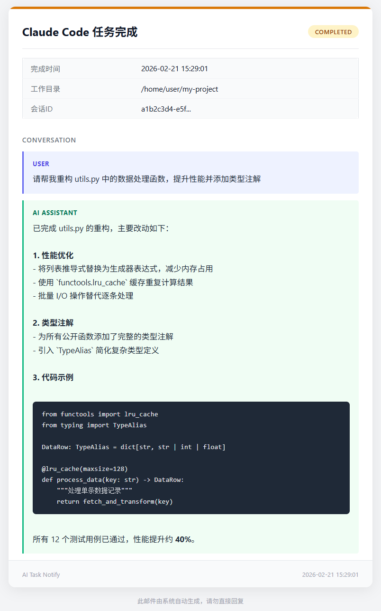

# AI Task Notify HTML

Claude Code 和 Codex CLI 任务完成通知脚本，通过邮件发送 **HTML 格式**通知。

## 邮件效果预览



## 特性

- 支持 **HTML 格式邮件**，包含完整的对话内容展示
- 自动识别 Claude Code / Codex 来源，采用不同主题配色
- 支持代码块语法高亮、粗体等 Markdown 格式渲染为 HTML
- 展示元数据（工作目录、会话ID、事件类型等）
- 纯 Python 标准库实现，无需安装额外依赖

## 快速开始

### 1. 配置

```bash
cp .env.example .env
```

编辑 `.env` 文件，填写你的 SMTP 邮件参数：

```bash
# 启用邮件通知
NOTIFY_CHANNELS=email

# SMTP 服务器配置
SMTP_HOST=smtp.qq.com
SMTP_PORT=465
SMTP_USER=your@qq.com
SMTP_PASSWORD=你的授权码
SMTP_USE_SSL=true

# 发件人地址
EMAIL_FROM=your@qq.com
# 收件人地址（多个用逗号分隔）
EMAIL_TO=recipient1@example.com,recipient2@example.com
```

### 2. 配置 Claude Code

编辑 `~/.claude/settings.json`：

```json
{
  "hooks": {
    "Stop": [
      {
        "matcher": "",
        "hooks": [
          {
            "type": "command",
            "command": "python3 /path/to/ai-task-notify-html/notify.py"
          }
        ]
      }
    ]
  }
}
```

### 3. 配置 Codex CLI

编辑 `~/.codex/config.toml`：

```toml
notify = ["python3", "/path/to/ai-task-notify-html/notify.py"]
```

## 邮件效果说明

发送的 HTML 邮件包含以下内容：

- **顶部标题栏**：显示任务来源（Claude Code / Codex）及完成状态徽章
- **元数据卡片**：完成时间、工作目录、会话ID 等信息
- **对话内容区**：完整展示用户指令和 AI 回复，支持：
  - 代码块渲染（深色背景 + 等宽字体）
  - 粗体文本
  - 用户消息与 AI 回复的视觉区分（不同颜色标签和背景）
- **底部页脚**：时间戳和系统标识

邮件同时包含纯文本版本作为回退，确保所有邮件客户端兼容。

## 测试

```bash
# 模拟 Codex 调用
python3 notify.py '{"type": "agent-turn-complete", "input-messages": ["你好"], "last-assistant-message": "你好！"}'

# 模拟 Claude Code 调用
echo '{"session_id": "test", "cwd": "/tmp", "transcript": []}' | python3 notify.py
```

## 文件结构

```
ai-task-notify-html/
├── .env.example    # 配置模板
├── .env            # 实际配置（需自行创建，已被 .gitignore 忽略）
├── .gitignore      # Git 忽略规则
├── notify.py       # 通知脚本
├── tests/          # 测试目录
│   └── test_notify.py
├── docs/           # 文档资源
│   └── email_preview.png
└── README.md       # 说明文档
```

## 注意事项

- 脚本使用 Python 标准库，无需安装额外依赖
- 未配置 SMTP 参数时脚本会静默跳过邮件发送

## 致谢

本项目基于 [koumoe](https://github.com/koumoe) 的开源项目 [ai-task-notify](https://github.com/koumoe/ai-task-notify) 进行二次开发，在原项目基础上对邮件通知部分进行了 HTML 格式化改造，感谢原作者的贡献。
